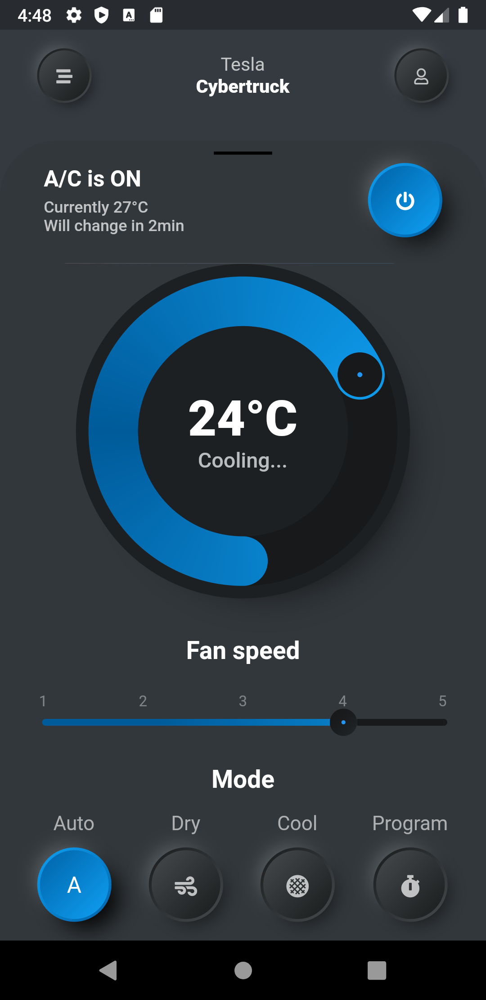

# Tesla Smart App - Flutter UI

This amazing UI is built on the amazing design of [Gavrisov Dmitri](https://dribbble.com/GavrisovDmitri "Gavrisov Dmitri").

- [Original Design](https://dribbble.com/shots/10196092-Tesla-Smart-App "Original Design URL")
- For more Flutter apps: [From Here](https://github.com/AhmedAbouelkher "profile")

## Design

## Implementation

  

  